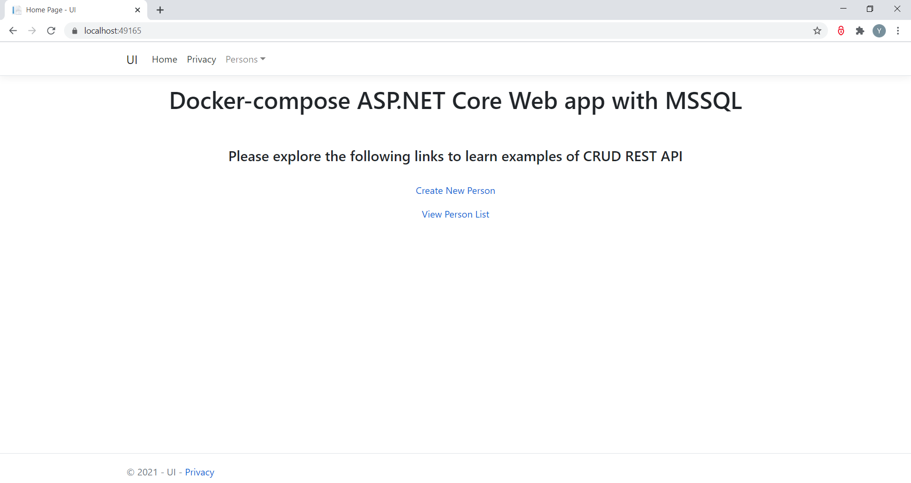
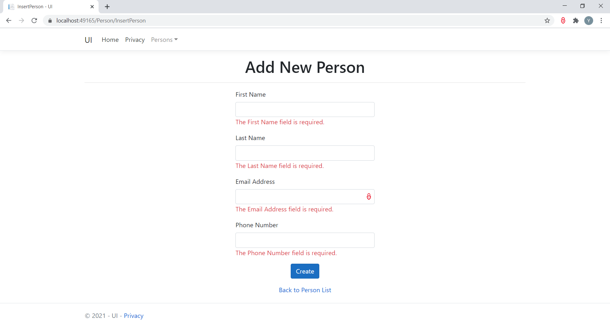
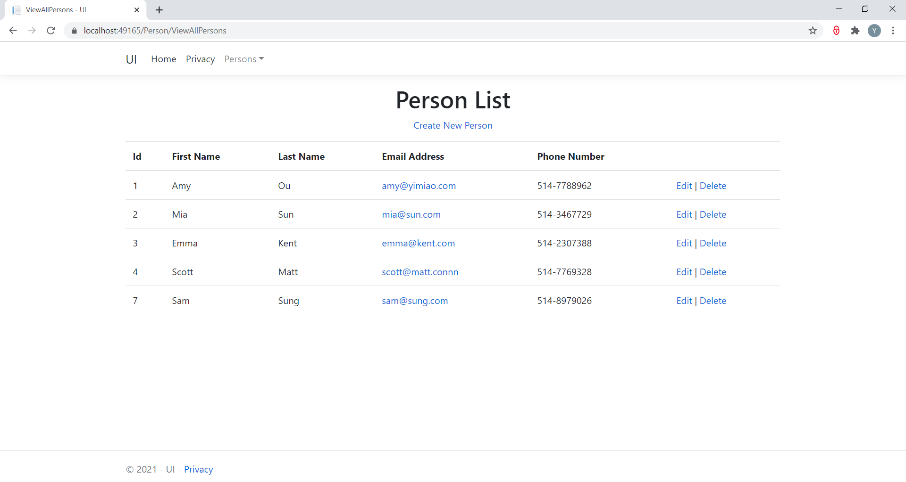

# Demo of using docker-compose to run ASP.NET Core Web app and MSSQL
<ul>
  <li>Data project contains Stored Procedures for storing and retrieving data in the Person Table</li>
  <li>DataLibrary is a Class Library that using ORM Dapper to communicate with the Database</li>
  <li>UI is an ASP.NET Core Web API(MVC) to demonstrate the CRUD REST API</li>
  <li>The sql-server image "netcoremssql" was created in the repository "NetCoreMssql.bak_RestoredAsImage_netcoremssql"</li>
</ul>

